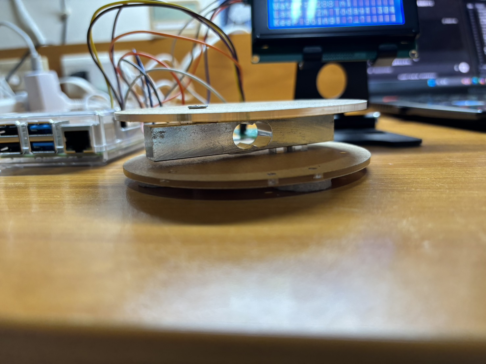
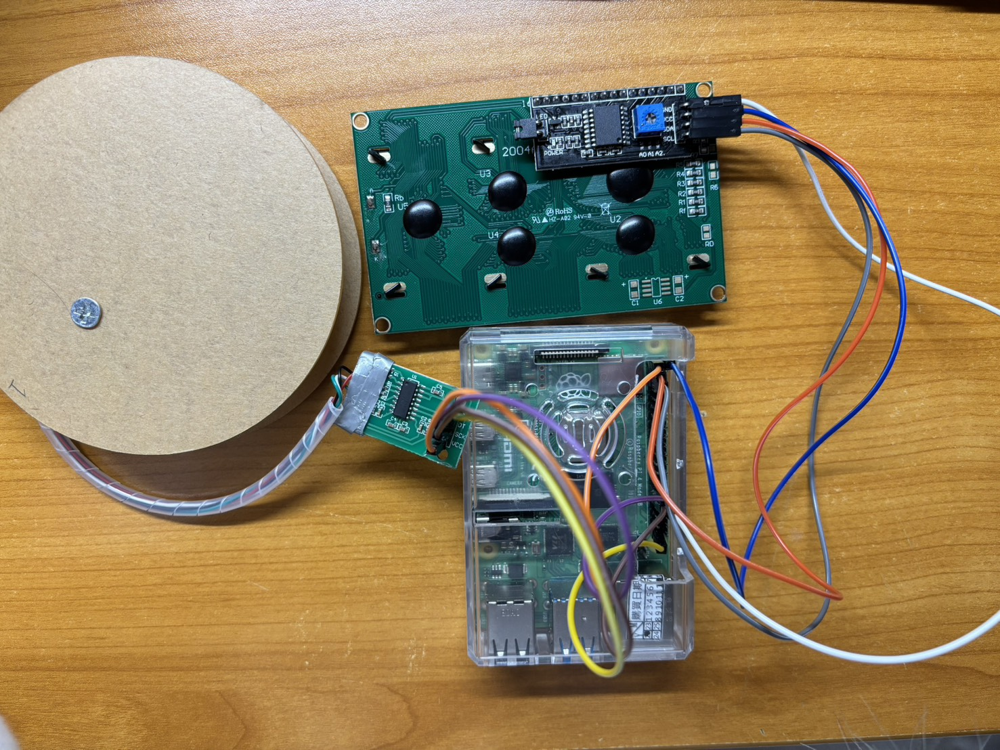
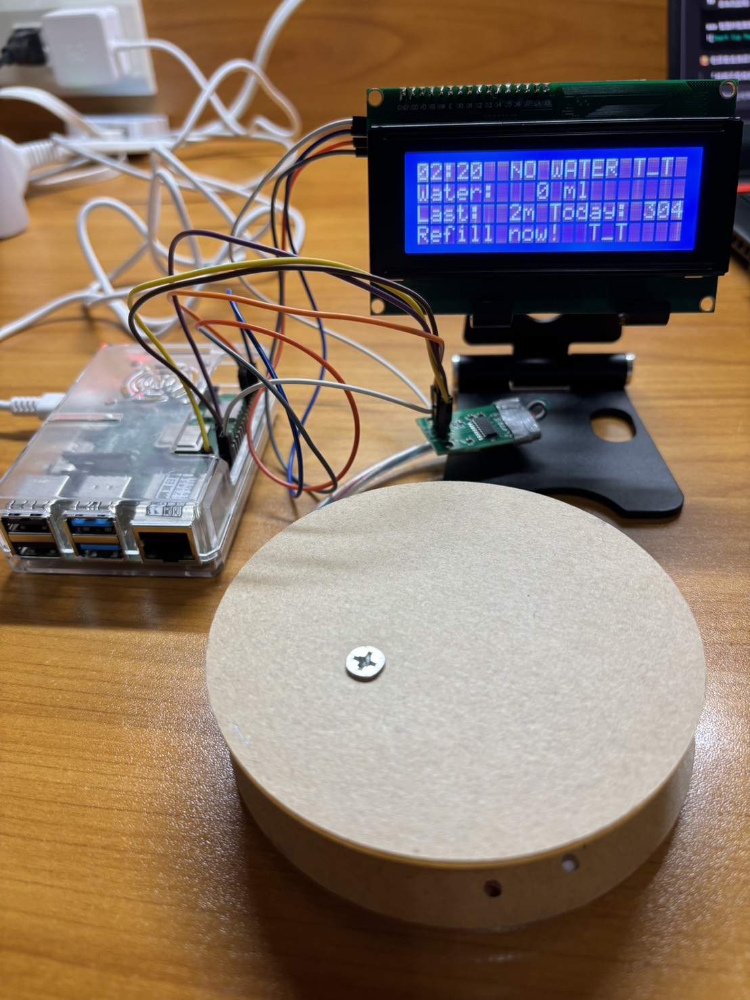

# Smart Hydration System 智慧飲水系統 

---
## 介紹（Overview）

現代人因長時間工作或讀書，常常忽略飲水，導致身體不適甚至影響健康。 
本專題「Smart Hydration System」旨在透過 IoT 技術，協助使用者即時掌握自身飲水狀況， 並透過系統提醒與紀錄功能，培養良好的飲水習慣。

系統適用於固定桌面環境（如書桌、辦公桌）， 結合實體顯示（LCD）與 Web 儀表板。 

--- 
## 系統功能（Features） 
- 即時量測水壺重量並換算為水量（ml）
- 自動判斷飲水事件並記錄飲水量
- 追蹤今日累積飲水量與距離上次飲水時間
- LCD 顯示即時狀態與提醒訊息
- Web 儀表板顯示即時狀態、歷史紀錄與飲水趨勢
- 支援多水壺管理
## 硬體需求（Hardware Requirements）
- Raspberry Pi 4
- Load Cell
- HX711 重量感測模組
- I2C LCD 顯示器（20x4）
- 壓克力板
- 支架
- 杜邦線
- USB 電源線
---
## 智慧杯墊結構說明
本系統將 Load Cell 夾設於上下兩塊壓克力板之間， 形成穩定的「智慧杯墊」結構。

- 上層壓克力板：放置水壺
- 中間 Load Cell：量測重量變化
- 下層壓克力板：固定與支撐

此結構可避免水壺直接壓迫感測器造成偏移， 並提升長時間使用的穩定性。

---
## 硬體接線說明（Wiring）
---



### Load Cell → HX711 
| Load Cell 線色 | HX711 腳位 | 
|---------------|-----------| 
| 紅線 | E+ | 
| 黑線 | E- | 
| 白線 | A- | 
| 綠線 | A+ | 

### HX711 → Raspberry Pi 
| HX711 | Raspberry Pi | 
|-----|--------------| 
| VCC | 5V |
| GND | GND |
| DT | GPIO 5 |
| SCK | GPIO 6 |
### I2C LCD → Raspberry Pi 
| LCD | Raspberry Pi | 
|----|--------------| 
| VCC | 5V | 
| GND | GND | 
| SDA | GPIO 2 | 
| SCL | GPIO 3 | 
---
## 軟體需求（Software Requirements） 
- 作業系統：Raspberry Pi OS
- Python 版本：Python 3.7 以上
---
## 安裝與執行步驟（Installation）
### 1️.更新系統
```bash
sudo apt update
sudo apt upgrade
```
### 2.啟用 I2C
```bash
sudo raspi-config
```
請依序選擇：
```pgsql
Interface Options → I2C → Enable
```
完成後重新開機：
```bash
sudo reboot
```
### 3.安裝 Python 套件
```bash
pip3 install -r requirements.txt
```
### 4.執行系統 
請先進入本專案資料夾：
```bash
cd IOT
```
接著請開啟兩個 Terminal 視窗，分別執行以下指令。

Terminal 1：啟動感測與秤重系統
```bash
python3 main.py
```
- `main.py`：  
  負責讀取 Load Cell（秤重器）資料、判斷飲水狀態，並將資料寫入資料庫。

Terminal 2：啟動 Web Dashboard
```bash
python3 app.py
```
- `app.py`：  
  啟動 Flask Web Server，提供即時監控與管理介面。
  
### 5.開啟 Web Dashboard 系統成功啟動後，請在瀏覽器輸入以下其中一個網址：
```text
http://raspberrypi.local:5000
```
或（在樹莓派本機）：
```text
http://localhost:5000
```
即可看到「智慧飲水系統」的即時監控畫面。

### 6.系統停止方式 
若要停止系統，請在各自執行程式的終端機中按下：
```text
Ctrl + C
```
即可安全結束系統。

---

## 專案結構說明（Project Structure）

```text
IOT/
├── main.py
├── app.py
├── database.py
├── hydration.db
├── templates/
│   ├── index.html
│   ├── bottles.html
│   ├── history.html
│   └── settings.html
└── README.md
```
- `main.py`：
讀取 Load Cell（秤重器）資料，判斷飲水事件，並將結果寫入資料庫。

- `app.py`：
啟動 Flask Web Server，提供即時監控與管理介面。

- `database.py`：
負責建立與管理 SQLite 資料庫，儲存飲水紀錄與系統設定。

- `hydration.db`：
系統使用的資料庫檔案，儲存飲水歷史資料。

- `templates/`：
存放 Web Dashboard 使用的 HTML 頁面。

---

## 系統展示（Demo）

本系統實際安裝於桌面環境，  
使用者只需將水壺放置於智慧杯墊上，即可自動量測飲水狀態並進行提醒。

### 系統整體實體展示



上圖為本系統實際運作情況，  
包含 Raspberry Pi、I2C LCD 顯示器與智慧杯墊。  
LCD 會即時顯示目前水量、距離上次飲水時間與提醒訊息。

### LCD 即時顯示與飲水狀態回饋


系統透過 I2C LCD 顯示目前飲水狀態，  
包含即時水量、距離上次飲水時間，以及今日累積飲水量。

當系統判斷使用者近期已有飲水行為時，  
LCD 會顯示「Hydration OK」與鼓勵訊息，  
提供即時且直觀的回饋，提醒使用者維持良好的飲水習慣。

### LCD 即時顯示與提醒功能


當使用者長時間未飲水時，  
LCD 會顯示提醒訊息，引導使用者補充水分。


當系統偵測到水壺重量變化時，  
會自動判斷為飲水行為並即時更新顯示內容。


若水壺內水量不足或被移開，  
系統會顯示缺水提示，提醒使用者補水。

### Web Dashboard 即時監控介面


Web Dashboard 提供即時飲水狀態監控，  
顯示目前水量、今日飲水進度與提醒資訊。


系統提供水壺管理介面，  
使用者可新增、編輯與刪除不同水壺設定，  
包含空壺重量與容量資訊。


系統會自動記錄每次飲水事件，  
並以表格與圖表方式呈現歷史飲水紀錄。


使用者可透過設定頁面調整每日飲水目標與提醒間隔。


[Demo影片](https://youtu.be/TH8C_G46ofw?si=vr4vYiZmCV4QIunp)
---

## 系統限制與未來改進（Limitations & Future Work）

- 本系統需固定放置於桌面環境，若移動水壺可能影響量測準確度。
- Load Cell 對環境震動較敏感，需避免劇烈碰撞。
- 目前提醒方式以視覺顯示為主，未來可加入聲音或手機通知。

未來可改進方向：
- 支援行動裝置推播提醒
- 增加使用者帳號與雲端同步
- 改善重量濾波演算法以提升準確度
---

## 參考資料（References）


1. HX711 Python Library  
   https://github.com/tatobari/hx711py

2. Flask Official Documentation  
   https://flask.palletsprojects.com/

3. Raspberry Pi GPIO Documentation  
   https://www.raspberrypi.com/documentation/

4.4.4
4.Getting Started with Load Cells      
  https://learn.sparkfun.com/tutorials/getting-started-with-load-

5. RPLCD Documentation  
   https://rplcd.readthedocs.io/


